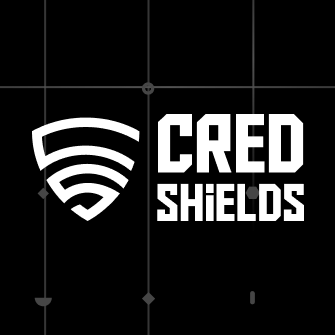

## About:

I'm security researcher specialized in **Solidity** and **Rust** (Solana, CosmWasm) audits. Conducted 125+ private audits in which **25+** was **Rust audits 🦀**. I've found **210+ Critical/High** so far.

For private audits or security consulting, please reach out to me on:

- Twitter: [@namx05](https://x.com/namx05)
- Telegram: [@namx05](https://t.me/namx05)

---

> [!TIP]
> The most interesting reports are marked 💎,
> mildly interesting as 👌 and

## Private Audits

|             | Protocol & Report                                                                        | Description                             | Ecosystem         | Provider                                                                               |
| ----------- | ---------------------------------------------------------------------------------------- | --------------------------------------- | ----------------- | -------------------------------------------------------------------------------------- |
|             |
| <b>2025</b> |
| 👌          | 🔒 Centrifuge                                                                            | Cross Chain AMM                         | ♦ EVM             |  BurraSec              |
| 👌          | [Vrine](audit-reports/pdf/Vrine-Smart-Contract-Audit-Report-Final-Report-v2.pdf)         | Presale Launchpad                       | ♦ EVM             |  Hashlock              |
| 👌          | [Mandala](audit-reports/pdf/Mandala_Presale_2_Final_Report.pdf)                          | Launchpad                               | ♦ EVM             |  Credshields        |
| 👌          | [Wager Program ](audit-reports/pdf/WAGER_PROGRAM_SMART_CONTRACT_AUDIT.pdf)               | GameFi                                  | 🦀 Solana         |  Solo                    |
| 👌          | [Better Bank](audit-reports/pdf/032_CODESPECT_BETTERBANK.pdf)                            | Lending & Borrowing                     | ♦ EVM             |  CODESPECT            |
| 💎          | [Etherspot: GTP Module](audit-reports/pdf/Etherspot-GTP-Module-Security-Review.pdf)      | Account Abstraction, Paymaster          | ♦ EVM             |  Shieldify         |
| 👌          | [Safle](audit-reports/pdf/Safle_Final_Audit_Report.pdf)                                  | Cross Chain Registrar                   | ♦ EVM             |  Credshields        |
| 💎          | [FUN Token Giveaway](audit-reports/pdf/Fun_Token_Final_Audit_Report.pdf)                 |                                         | ♦ EVM             |  Credshields        |
| 👌          | [Beetle Games](audit-reports/pdf/Beetle-Security-Review.pdf)                             | NFT Staking, GameFi                     | ♦ EVM             |  Shieldify         |
| 💎          | 🔒 Amgi Studios [Round 2]                                                                | Cross Chain NFT Staking                 | ♦ EVM             |  Credshields        |
| 💎          | NDA                                                                                      | TradFi                                  | 🦀 Solana         |  Crfrin                  |
| 👌          | [Vouch](audit-reports/pdf/Vouch_Token_and_Distribution_Final_Audit_Report.pdf)           | Tokenomics                              | ♦ EVM             |  Credshields        |
| 👌          | [Zodor](audit-reports/pdf/Zodor_Staking_Final_Audit_Report.pdf)                          | Staking                                 | ♦ EVM             |  Credshields        |
| 💎          | [Taco Studios: Okidori](audit-reports/pdf/Okidori_Final_Audit_Report.pdf)                | NFT Tokonomics, Marketplace, Royalty    | ♦ EVM             |  Credshields        |
| 💎          | [Tarmiiz](audit-reports/pdf/Tarmiiz_Final_Audit_Report.pdf)                              | Staking Vault                           | ♦ EVM             |  Credshields        |
| 💎          | 🔒 Amgi Studios                                                                          | Cross Chain NFT Staking                 | ♦ EVM             |  Credshields        |
| 💎          | [GlueX Protocol](audit-reports/pdf/GlueX-V2-Security-Review.pdf)                         | DeFi, Router                            | ♦ EVM             |  Shieldify         |
| 💎          | [DotLabs: Mushi](audit-reports/pdf/Mushi_V2_0_Final_Audit_Report.pdf)                    | DeFi, Lending/Borrowing                 | 🦀 Solana         |  Credshields        |
| 👌          | [Manadotwin](audit-reports/pdf/Manadotwin_Audit_Final_Report.pdf)                        | Vesting, Bonding Curve                  | ♦ EVM             |  Credshields        |
| 💎          | 🔒 Amgi Studios                                                                          | NFT Staking, Tokenomics                 | ♦ EVM             |  Credshields        |
| 💎          | 🔒 Real Proton                                                                           | Tokenomics                              | ♦ EVM             |  Credshields        |
| 👌          | 🔒 Clique Lock                                                                           | Vesting, SPL                            | 🦀 Solana         |  Safe Edges           |
| 👌          | [Terplayer Hodl](audit-reports/pdf/Terplayer-Hodl-Security-Review.pdf)                   | DeFi, Lending/Borrowing                 | 🐻 Berachain      |  Shieldify         |
| 💎          | 🔒 Ginza Gaming                                                                          | Staking, GameFi                         | 🦀 Solana / ♦ EVM |  Guardian Audits |
| 💎          | 🔒 Power Couple Coin: Staking Panelty                                                    | Staking                                 | 🦀 Solana         |  Credshields        |
| 💎          | 🔒 Power Couple Coin: Staking                                                            | Staking                                 | 🦀 Solana         |  Credshields        |
| 💎          | 🔒 Power Couple Coin: Selltax                                                            | DeFi                                    | 🦀 Solana         |  Credshields        |
| 💎          | [Power Couple Coin: Lottery](audit-reports/pdf/Lottery_Contracts_Final_Audit_Report.pdf) | Staking, Lottery                        | 🦀 Solana         |  Credshields        |
| 💎          | [Artulabs Limited](audit-reports/pdf/Artu_Rust_Final_Audit_Report.pdf)                   | Airdrop, SPL Tokens                     | 🦀 Solana         |  Credshields        |
| 👌          | [Artulabs Limited](audit-reports/pdf/Artu_Solidity_Final_Audit_Report.pdf)               | Vesting, ERC20                          | ♦ EVM             |  Credshields        |
| 👌          | [LERN360](audit-reports/pdf/LERNToken_Final_Audit_Report.pdf)                            | ERC20                                   | ♦ EVM             |  Credshields        |
| 💎          | [Fomodotbiz](audit-reports/pdf/Fomodotbiz_Final_Audit_Report.pdf)                        | AMM, Bonding Curve                      | ♦ EVM             |  Credshields        |
| 👌          | [mew.gg](audit-reports/pdf/mew.gg_Contracts_Final_Audit_Report.pdf)                      | AMM                                     | ♦ EVM             |  Credshields        |
| 👌          | [Hemi Labs](audit-reports/pdf/Hemi_Labs_Final_Audit_Report.pdf)                          | Vault                                   | ♦ EVM             |  Credshields        |
| 👌          | 🔒 FLAT Protocol                                                                         | Defi, Staking, Vesting                  | ♦ EVM             |  Solo                    |
| 👌          | [W3.Labs](audit-reports/pdf/W3.labs_Final_Audit_Report.pdf)                              | Staking Vault                           | ♦ EVM             |  Credshields        |
| 👌          | [After Finance](audit-reports/pdf/After-Finance-Report.pdf)                              | Lending/Borrowing, Yeild                | ♦ EVM             | Arsen Blockchain Security                                                              |
| 👌          | [BRLA Digital](audit-reports/pdf/BRLA_Final_Audit_Report.pdf)                            | ERC20 Token Swap                        | ♦ EVM             |  Credshields        |
| 💎          | [Metaco Intelligence Corporation](audit-reports/pdf/Zoth_Final_Audit_Report.pdf)         | Restaking                               | ♦ EVM             |  Credshields        |
| 💎          | [Landslide](audit-reports/pdf/Landslide_Final_Audit_Report.pdf)                          | ICM (interchain Messaging), Cross Chain | ♦ EVM             |  Credshields        |
|          |
| <b>2024</b> |
| 💎          | 🔒 Superbots                                                                             | Trading Vault                           | ♦ EVM             |  Credshields        |
| 👌          | [AllinGames: Bacarrat](audit-reports/pdf/AllInGames_Baccarat_Final_Audit_Report.pdf)     | GameFi                                  | 🦀 CosmWasm       |  Credshields        |
| 💎 💎       | [AllinGames: Bank](audit-reports/pdf/AllInGames_Bank_Final_Audit_Report.pdf)             | GameFi                                  | 🦀 CosmWasm       |  Credshields        |
| 💎          | [AllinGames: Classic](audit-reports/pdf/AllInGames_Classic_Dice_Final_Audit_Report.pdf)  | GameFi                                  | 🦀 CosmWasm       |  Credshields        |
| 💎          | [AllinGames: Coin Flip](audit-reports/pdf/AllInGames_Coin_Flip_Final_Audit_Report.pdf)   | GameFi                                  | 🦀 CosmWasm       |  Credshields        |
| 💎          | [AllinGames: Hash Dice](audit-reports/pdf/AllInGames_Hash_Dice_Final_Audit_Report.pdf)   | GameFi                                  | 🦀 CosmWasm       |  Credshields        |
| 👌          | [AllinGames: Limbo](audit-reports/pdf/AllInGames_Limbo_Final_Audit_Report.pdf)           | GameFi                                  | 🦀 CosmWasm       |  Credshields        |
| 💎          | [AllinGames: Lottery](audit-reports/pdf/AllInGames_Lottery_Final_Audit_Report.pdf)       | GameFi                                  | 🦀 CosmWasm       |  Credshields        |
| 👌          | [Arcana: Browser Extenstion](audit-reports/pdf/Arcana_Wallet_Final_Audit_Report.pdf)     | Wallet                                  | Bowser Extenstion |  Credshields        |
| 💎          | 🔒 AllinGames: Exchange V2                                                               | GameFi                                  | 🦀 CosmWasm       |  Credshields        |
| 💎          | 🔒 Arcana: Vault                                                                         | ERC4626, Vault                          | ♦ EVM             |  Credshields        |
| 💎          | 🔒 Dojima                                                                                | DLT, Omni Chain                         | Go                |  Credshields        |
| 💎          | [Save Planet Earth](audit-reports/pdf/SPE_Smart_Contract_Final_Audit_Report.pdf)         | DeFi                                    | ♦ EVM             |  Credshields        |
| 👌          | [Lara Protocol](audit-reports/pdf/Lara_Liquid_Staking_Final_Audit_Report.pdf)            | Staking, Vesting                        | ♦ EVM             |  Credshields        |
| 💎          | 🔒 Dojima                                                                                | Omni Chain                              | 🦀 Solana         |  Credshields        |
| 💎          | 🔒 Lendtroller                                                                           | Cross Chain                             | ♦ EVM             |  Credshields        |
| 💎          | 🔒 Balance                                                                               | Airdrop, Tokenomics                     | ♦ EVM             |  Credshields        |
| 💎          | 🔒 Dojima                                                                                | Omni Chain, Cross Chain                 | ♦ EVM             |  Credshields        |
| 👌          | [Protop Vesting](audit-reports/pdf/Protop_Vesting_Contracts_Final_Report.pdf)            |                                         | ♦ EVM             |  Credshields        |
| 👌          | [Vouch](audit-reports/pdf/Vouch_Contract_Final_Audit_Report.pdf)                         |                                         | ♦ EVM             |  Credshields        |
| 👌          | [SAN](audit-reports/pdf/SAN_Final_Report.pdf)                                            |                                         | ♦ EVM             |  Credshields        |
| 👌          | 🔒 Registrar                                                                             | ENS                                     | ♦ EVM             |  Credshields        |
| 👌          | [Tribally Games](audit-reports/pdf/Tribally_Games_Final_Report.pdf)                      |                                         | ♦ EVM             |  Credshields        |
| 💎          | [Plutope](audit-reports/pdf/Plutope_Final_Audit_Report.pdf)                              | DeFi                                    | ♦ EVM             |  Credshields        |
| 💎          | [LogX](audit-reports/pdf/LogX_Token_Final_Report.pdf)                                    | Validator                               | ♦ EVM             |  Credshields        |
| 👌          | [Kresus](audit-reports/pdf/Kresus_Final_Audit_Report.pdf)                                | Account Abstraction                     | ♦ EVM             |  Credshields        |
| 💎          | [Rex Protocol](audit-reports/pdf/Rex_Exchange_Final_Audit_Report.pdf)                    | DeFi, Staking                           | ♦ EVM             |  Credshields        |
| 💎          | [aUSD: Stable Jack](audit-reports/pdf/aUSD_SC_Final_Audit_Report.pdf)                    | AMM                                     | ♦ EVM             |  Credshields        |
| 👌          | [Arcana Staking](audit-reports/pdf/Arcana_Staking_Contract_Final_Audit_Report.pdf)       | Staking                                 | ♦ EVM             |  Credshields        |
| 💎          | [Wasset](audit-reports/pdf/Wasset_Final_Audit_Report.pdf)                                | Staking, Vesting                        | ♦ EVM             |  Credshields        |
| 👌          | [Numa](audit-reports/pdf/Numa_Final_Audit_Report.pdf)                                    | DeFi, Lending/Borrowing                 | ♦ EVM             |  Credshields        |
| 👌          | [Hyacinth](audit-reports/md/Hyacinth-security-review.md)                                 | Bank, DeFi                              | ♦ EVM             |  Solo                    |

## Public Audits:

Public Contest portfolio by [`Sherlock`](https://audits.sherlock.xyz/watson/namx05)

| Rank | Report                                                                                                                                                                                           | Description       | Critical/High | Medium | Lang-Ecosystem |
| ---- | ------------------------------------------------------------------------------------------------------------------------------------------------------------------------------------------------ | ----------------- | ------------- | ------ | -------------- |
|      |                                                                                                                                                                                                  |                   |               |        |                |
| 7    |  [Metropolis](https://cantina.xyz/competitions/076935b1-2706-48c6-bf0a-b3656aa24194/leaderboard)                                  | Lending/Borrwoing |               | 1      | ♦ EVM          |
| 44   |  [Eggstravaganza](https://codehawks.cyfrin.io/c/2025-04-eggstravaganza/results?lt=contest&page=5&sc=xp&sj=reward&t=leaderboard) | GameFi, NFT       | 2             |        | ♦ EVM          |
| 62   |  [Rust Fund](https://codehawks.cyfrin.io/c/2025-03-rustfund/results?lt=contest&page=1&sc=xp&sj=reward&t=leaderboard)            | Crowdfunding      | 1             | 2      | 🦀 Solana      |
| 16   |  [Hyperland](https://cantina.xyz/competitions/cd180bb3-5d7d-46ed-8b99-d905e54a9d0b/leaderboard)                                   | Lending/Borrowing | 1             |        | ♦ EVM          |
| 177  |  [Tadle](https://codehawks.cyfrin.io/c/2024-08-tadle/results?lt=contest&page=1&sc=reward&sj=reward&t=leaderboard)               | Bridge            |               | 1      | ♦ EVM          |
| 39   |  [Trait Forge](https://code4rena.com/audits/2024-07-traitforge)                                                                        | GameFi            | 1             |        | ♦ EVM          |
| 89   |  [Pool Together](https://code4rena.com/audits/2023-07-pooltogether)                                                                    | Staking, Yeild    |               | 1      | ♦ EVM          |
