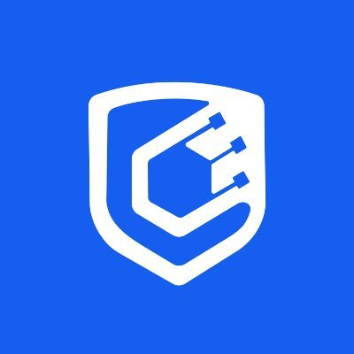
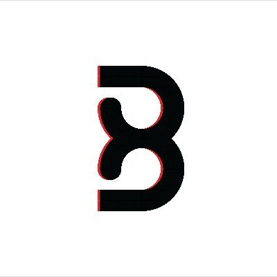
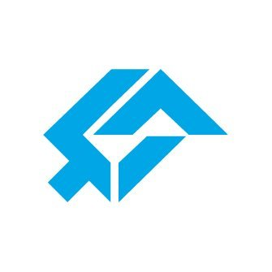
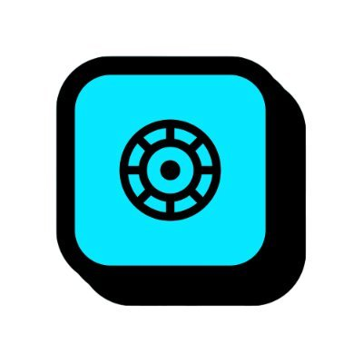

# About naman:

- He's an independent security researcher with focused expertise in auditing **Solidity**, **Rust** based contracts and decentralized infrastructure across leading blockchain ecosystems, including **EVM**, **Solana**, **Cosmos** **(CosmWasm)**.
- With over 150+ reviews conducted across public, private, and firm engagements in which **30** was **Rust audits 🦀**. Have audited a diverse range of DeFi protocols, including **DEXs, AMMs, GameFi, TradeFi, Account Abstraction, DeFi, order books, cross-chain, bridges, Launchpads and bonding curves**.

- He is trusted by:  Cyfrin,  Guardian,  Credshields ,  CODESPECT ,  BurraSec,  Shieldify,  Hashlock, and  Safe Edges.

For private audits or security consulting, please reach out to me on via:

- Twitter: [@namx05](https://x.com/namx05)
- Telegram: [@namx05](https://t.me/namx05)

---

## Summary

|   Crit/High    | Medium risk | [Public Audits](#public-audits) | [Private Audits](#private-audits) |
| :------------: | :---------: | :-----------------------------: | :-------------------------------: |
| 330+ Crit/High | 300+ Medium |                8                |                148                |

## naman 🤝 Firm Engagement Review

| Protocol              | Description                    | Ecosystem         | Report / Findings                                                                                  | Provider                                                                               |
| --------------------- | ------------------------------ | ----------------- | -------------------------------------------------------------------------------------------------- | -------------------------------------------------------------------------------------- |
| <u><b>2025 </b> </u>  |
| Clique Lock           | Merkle Distributor             | 🦀 Solana         | 🔒 [1 High, 4 Medium]                                                                              |  Safe Edges           |
| Redacted              | TradeFi, SPL Whitelisting      | 🦀 Solana         | 🔒 [-]                                                                                             |  Cyfrin                  |
| Redacted              | TradeFi                        | 🦀 Solana         | 🔒 [-]                                                                                             |  Cyfrin                  |
| dTrinity              | AMM, Staking                   | ♦ EVM             | 🔒 [-]                                                                                             |  Hashlock              |
| ShowDown              | GameFi                         | 🦀 Solana         | 🔒 [1 High, 3 Medium]                                                                              |  Cyfrin                  |
| N4T                   | Launchpad                      | ♦ EVM             | [4 High, 5 Medium](audit-reports/pdf/N4T-Smart-Contract-Audit-Report-Final-Report-v2.pdf)          |  Hashlock              |
| Emergence Art         | NFT Sale                       | ♦ EVM             | [2 High, 2 Medium](audit-reports/pdf/Emergence.art-Smart-Contract-Audit-Report-Final-Repot-v2.pdf) |  Hashlock              |
| Centrifuge            | Cross Chain, AMM               | ♦ EVM             | 🔒 [1 High]                                                                                        |  BurraSec              |
| Vrine                 | Presale, Launchpad             | ♦ EVM             | [1 High, 2 Medium](audit-reports/pdf/Vrine-Smart-Contract-Audit-Report-Final-Report-v2.pdf)        |  Hashlock              |
| Wager Program (Draft) | GameFi                         | 🦀 Solana         | [2 High](audit-reports/pdf/WAGER_PROGRAM_SMART_CONTRACT_AUDIT.pdf)                                 |  Solo                    |
| Better Bank           | Lending                        | ♦ EVM             | [6 Medium](audit-reports/pdf/032_CODESPECT_BETTERBANK.pdf)                                         |  CODESPECT            |
| Etherspot: GTP Module | Account Abstraction, Paymaster | ♦ EVM             | [1 Critical, 3 High, 6 Medium](audit-reports/pdf/Etherspot-GTP-Module-Security-Review.pdf)         |  Shieldify         |
| Beetle Games          | NFT Staking, GameFi            | ♦ EVM             | [1 Critical, 1 Medium](audit-reports/pdf/Beetle-Security-Review.pdf)                               |  Shieldify         |
| Redacted              | TradFi                         | 🦀 Solana         | 🔒 [-]                                                                                             |  Cyfrin                  |
| GlueX Protocol        | DeFi, Router                   | ♦ EVM             | [3 High, 2 Medium](audit-reports/pdf/GlueX-V2-Security-Review.pdf)                                 |  Shieldify         |
| Clique Lock           | Vesting, SPL                   | 🦀 Solana         | 🔒 [4 Medium]                                                                                      |  Safe Edges           |
| Terplayer Hodl        | DeFi, Lending/Borrowing        | 🐻 Berachain      | [1 Medium](audit-reports/pdf/Terplayer-Hodl-Security-Review.pdf)                                   |  Shieldify         |
| Ginza Gaming          | Cross Chain, GameFi            | 🦀 Solana / ♦ EVM | 🔒 [3 Critical, 2 High, 5 Medium]                                                                  |  Guardian Audits |
| FLAT Protocol         | Defi, Staking, Vesting         | ♦ EVM             | 🔒 [1 Critical, 1 High, 1 Medium]                                                                  |  Solo                    |
| After Finance         | Lending, Yeild                 | ♦ EVM             | [1 Medium](audit-reports/pdf/After-Finance-Report.pdf)                                             | Arsen Blockchain Security                                                              |

## naman 🤝 Credshields Review

| Protocol                        | Description                             | Ecosystem         | Report / Findings                                                                               |
| ------------------------------- | --------------------------------------- | ----------------- | ----------------------------------------------------------------------------------------------- |
| <u><b>2025 </b> </u>            |
| Okidori: Boosterpack            | NFT Rewards                             | ♦ EVM             | [1 High, 4 Medium](audit-reports/pdf/Okidori_Booster_Pack_Final_Report.pdf)                     |
| LERN360                         | Staking                                 | ♦ EVM             | [6 Critical, 10 High, 8 Medium](audit-reports/pdf/LERN360_ICO_Contracts_Final_Audit_Report.pdf) |
| Vouch                           | Staking                                 | ♦ EVM             | [1 Critical, 2 High, 2 Medium](audit-reports/pdf/Vouch_Staking_Final_Audit_Report.pdf)          |
| Capx: Onramp Bridge             | Bridge                                  | ♦ EVM             | [2 Low](audit-reports/pdf/Capx_Onramp_Bridge_Final_Audit_Report.pdf)                            |
| Capx Launchpad                  | Launchpad                               | ♦ EVM             | [4 Low](audit-reports/pdf/Capx_Launchpad_Final_Audit_Report.pdf)                                |
| Mandala                         | Launchpad                               | ♦ EVM             | [1 High](audit-reports/pdf/Mandala_Presale_2_Final_Report.pdf)                                  |
| Safle                           | Cross Chain Registrar                   | ♦ EVM             | [2 Critical, 1 High, 3 Medium](audit-reports/pdf/Safle_Final_Audit_Report.pdf)                  |
| FUN Token Giveaway              | -                                       | ♦ EVM             | [11 Critical, 7 High, 4 Medium](audit-reports/pdf/Fun_Token_Final_Audit_Report.pdf)             |
| Amgi Studios Round 2            | Cross Chain, Staking                    | ♦ EVM             | 🔒 [7 Critical, 2 High, 2 Medium]                                                               |
| Vouch                           | Tokenomics                              | ♦ EVM             | [2 Critical, 5 Medium](audit-reports/pdf/Vouch_Token_and_Distribution_Final_Audit_Report.pdf)   |
| Zodor                           | Staking                                 | ♦ EVM             | [2 Critical, 1 Medium](audit-reports/pdf/Zodor_Staking_Final_Audit_Report.pdf)                  |
| Taco Studios: Okidori           | NFT Tokonomics, Marketplace             | ♦ EVM             | [2 Critical, 1 High, 1 Medium](audit-reports/pdf/Okidori_Final_Audit_Report.pdf)                |
| Tarmiiz                         | Staking Vault                           | ♦ EVM             | [2 Critical, 3 High, 5 Medium](audit-reports/pdf/Tarmiiz_Final_Audit_Report.pdf)                |
| Amgi Studios                    | Cross Chain NFT Staking                 | ♦ EVM             | 🔒[16 Critical, 7 High, 7 Medium]                                                               |
| DotLabs: Mushi                  | DeFi, Lending                           | 🦀 Solana         | [1 Critical, 3 High, 4 Medium](audit-reports/pdf/Mushi_V2_0_Final_Audit_Report.pdf)             |
| Manadotwin                      | Vesting, Bonding Curve                  | ♦ EVM             | [2 Critical, 1 High, 2 Medium](audit-reports/pdf/Manadotwin_Audit_Final_Report.pdf)             |
| Amgi Studios                    | NFT Staking, Tokenomics                 | ♦ EVM             | 🔒 [4 Critical, 3 High, 2 Medium]                                                               |
| Real Proton                     | Tokenomics                              | ♦ EVM             | 🔒 [4 Critical, 3 High, 4 Medium]                                                               |
| PCC: Staking Panelty            | Staking                                 | 🦀 Solana         | 🔒 [4 Critical, 1 Medium]                                                                       |
| PCC: Staking                    | Staking                                 | 🦀 Solana         | 🔒 [4 Critical, 2 Medium]                                                                       |
| PCC: Selltax                    | DeFi                                    | 🦀 Solana         | 🔒 [6 Critical, 2 Medium]                                                                       |
| PCC: Lottery                    | Staking, Lottery                        | 🦀 Solana         | [6 Critical, 1 High, 3 Medium](audit-reports/pdf/Lottery_Contracts_Final_Audit_Report.pdf)      |
| Artulabs Limited                | Airdrop, SPL Tokens                     | 🦀 Solana         | [1 Critical, 3 High, 3 Medium](audit-reports/pdf/Artu_Rust_Final_Audit_Report.pdf)              |
| Artulabs Limited                | Vesting, ERC20                          | ♦ EVM             | [1 High, 2 Medium](audit-reports/pdf/Artu_Solidity_Final_Audit_Report.pdf)                      |
| LERN360                         | ERC20                                   | ♦ EVM             | [2 High](audit-reports/pdf/LERNToken_Final_Audit_Report.pdf)                                    |
| Fomodotbiz                      | AMM, Bonding Curve                      | ♦ EVM             | [3 Critical, 3 Medium](audit-reports/pdf/Fomodotbiz_Final_Audit_Report.pdf)                     |
| mew.gg                          | AMM                                     | ♦ EVM             | [1 High](audit-reports/pdf/mew.gg_Contracts_Final_Audit_Report.pdf)                             |
| Hemi Labs                       | Vault                                   | ♦ EVM             | [1 High, 3 Medium](audit-reports/pdf/Hemi_Labs_Final_Audit_Report.pdf)                          |
| W3.Labs                         | Staking Vault                           | ♦ EVM             | [4 Medium](audit-reports/pdf/W3.labs_Final_Audit_Report.pdf)                                    |
| BRLA Digital                    | AMM                                     | ♦ EVM             | [2 Critical, 4 Medium](audit-reports/pdf/BRLA_Final_Audit_Report.pdf)                           |
| Metaco Intelligence Corporation | Restaking                               | ♦ EVM             | [1 Critical, 2 High, 3 Medium](audit-reports/pdf/Zoth_Final_Audit_Report.pdf)                   |
| Landslide                       | ICM (interchain Messaging), Cross Chain | ♦ EVM             | [4 Critical, 3 High, 1 Medium](audit-reports/pdf/Landslide_Final_Audit_Report.pdf)              |
| <u><b>2024 </b> </u>            |
| Superbots                       | Trading Vault                           | ♦ EVM             | 🔒 [3 Critical, 2 High, 5 Medium]                                                               |
| AllinGames: Bacarrat            | Casino                                  | 🦀 CosmWasm       | [1 Medium](audit-reports/pdf/AllInGames_Baccarat_Final_Audit_Report.pdf)                        |
| AllinGames: Bank                | Casino                                  | 🦀 CosmWasm       | [4 Critical, 5 Medium](audit-reports/pdf/AllInGames_Bank_Final_Audit_Report.pdf)                |
| AllinGames: Classic             | Casino                                  | 🦀 CosmWasm       | [1 Critical, 1 Medium](audit-reports/pdf/AllInGames_Classic_Dice_Final_Audit_Report.pdf)        |
| AllinGames: Coin Flip           | Casino                                  | 🦀 CosmWasm       | [1 Critical, 1 High](audit-reports/pdf/AllInGames_Coin_Flip_Final_Audit_Report.pdf)             |
| AllinGames: Hash Dice           | Casino                                  | 🦀 CosmWasm       | [1 Critical, 1 High](audit-reports/pdf/AllInGames_Hash_Dice_Final_Audit_Report.pdf)             |
| AllinGames: Limbo               | Casino                                  | 🦀 CosmWasm       | [2 Medium](audit-reports/pdf/AllInGames_Limbo_Final_Audit_Report.pdf)                           |
| AllinGames: Lottery             | Casino                                  | 🦀 CosmWasm       | [2 Critical, 1 Medium](audit-reports/pdf/AllInGames_Lottery_Final_Audit_Report.pdf)             |
| Arcana: Browser Extenstion      | Wallet                                  | Bowser Extenstion | [1 Medium](audit-reports/pdf/Arcana_Wallet_Final_Audit_Report.pdf)                              |
| AllinGames: Exchange V2         | Casino                                  | 🦀 CosmWasm       | 🔒 [5 Critical,4 Medium]                                                                        |
| Arcana: Vault                   | ERC4626, Vault                          | ♦ EVM             | 🔒 [1 High, 3 Medium]                                                                           |
| Dojima                          | DLT, Omni Chain                         | Go                | 🔒 [1 Critical, 1 High, 6 Medium]                                                               |
| Save Planet Earth               | DeFi                                    | ♦ EVM             | [2 Critical, 1 High,2 Medium](audit-reports/pdf/SPE_Smart_Contract_Final_Audit_Report.pdf)      |
| Lara Protocol                   | Staking, Vesting                        | ♦ EVM             | [5 Medium](audit-reports/pdf/Lara_Liquid_Staking_Final_Audit_Report.pdf)                        |
| Dojima                          | Omni Chain                              | 🦀 Solana         | 🔒 [3 High, 4 Medium]                                                                           |
| Lendtroller                     | Cross Chain                             | ♦ EVM             | 🔒 [2 Critical, 1 High, 3 Medium]                                                               |
| Balance                         | Airdrop, Tokenomics                     | ♦ EVM             | 🔒 [1 Critical, 2 High, 4 Medium]                                                               |
| Dojima                          | Omni Chain, Cross Chain                 | ♦ EVM             | 🔒 [5 Critical, 7 High, 3 Medium]                                                               |
| Protop Vesting                  |                                         | ♦ EVM             | [1 Critical](audit-reports/pdf/Protop_Vesting_Contracts_Final_Report.pdf)                       |
| Vouch                           |                                         | ♦ EVM             | [1 High, 1 Medium](audit-reports/pdf/Vouch_Contract_Final_Audit_Report.pdf)                     |
| SAN                             |                                         | ♦ EVM             | [1 High, 4 Medium](audit-reports/pdf/SAN_Final_Report.pdf)                                      |
| Registrar                       | ENS                                     | ♦ EVM             | 🔒 [2 Medium]                                                                                   |
| Tribally Games                  |                                         | ♦ EVM             | [1 High](audit-reports/pdf/Tribally_Games_Final_Report.pdf)                                     |
| Plutope                         | DeFi                                    | ♦ EVM             | [2 Critical, 5 Medium](audit-reports/pdf/Plutope_Final_Audit_Report.pdf)                        |
| LogX                            | Validator                               | ♦ EVM             | [3 Critical, 2 High, 2 Medium](audit-reports/pdf/LogX_Token_Final_Report.pdf)                   |
| Kresus                          | Account Abstraction                     | ♦ EVM             | [1 Critical, 1 High, 1 Medium](audit-reports/pdf/Kresus_Final_Audit_Report.pdf)                 |
| Rex Protocol                    | DeFi, Staking                           | ♦ EVM             | [1 Critical, 5 High, 4 Medium](audit-reports/pdf/Rex_Exchange_Final_Audit_Report.pdf)           |
| aUSD: Stable Jack               | AMM                                     | ♦ EVM             | [3 Critical, 2 High, 11 Medium](audit-reports/pdf/aUSD_SC_Final_Audit_Report.pdf)               |
| Arcana Staking                  | Staking                                 | ♦ EVM             | [1 High](audit-reports/pdf/Arcana_Staking_Contract_Final_Audit_Report.pdf)                      |
| Wasset                          | Staking, Vesting                        | ♦ EVM             | [2 Critical, 3 Medium](audit-reports/pdf/Wasset_Final_Audit_Report.pdf)                         |
| Numa                            | DeFi, Lending                           | ♦ EVM             | [1 Medium](audit-reports/pdf/Numa_Final_Audit_Report.pdf)                                       |

## Public Audits:

| Rank | Public/Contest                                                                                     | Description           | Lang-Ecosystem | Report / Leaderboard                                                                                                        |
| ---- | -------------------------------------------------------------------------------------------------- | --------------------- | -------------- | --------------------------------------------------------------------------------------------------------------------------- |
| 🥇   |  Prime Skills (Draft)             | GameFi                | 🦀 Solana      | [2 High, 2 Low](https://earn.superteam.fun/listing/smart-contract-improvement-and-audit-for-gaming-protocol)                |
| 43   |  Super DCA Liquidity Network       | AMM, Uniswap V4 Hooks | ♦ EVM          | [1 High, 1 Medium](https://audits.sherlock.xyz/contests/1171?filter=results)                                                |
| 7    |  Metropolis                         | Lending/Borrwoing     | ♦ EVM          | [1 Medium ](https://cantina.xyz/competitions/076935b1-2706-48c6-bf0a-b3656aa24194/leaderboard)                              |
| 44   |  Eggstravaganza                   | GameFi, NFT           | ♦ EVM          | [2 High ](https://codehawks.cyfrin.io/c/2025-04-eggstravaganza/results?lt=contest&page=5&sc=xp&sj=reward&t=leaderboard)     |
| 62   |  Rust Fund                        | Crowdfunding          | 🦀 Solana      | [1 High, 2 Medium ](https://codehawks.cyfrin.io/c/2025-03-rustfund/results?lt=contest&page=1&sc=xp&sj=reward&t=leaderboard) |
| 16   |  Hyperland                          | Lending/Borrowing     | ♦ EVM          | [1 High ](https://cantina.xyz/competitions/cd180bb3-5d7d-46ed-8b99-d905e54a9d0b/leaderboard)                                |
| 177  |  Tadle                            | Bridge                | ♦ EVM          | [1 Medium ](https://codehawks.cyfrin.io/c/2024-08-tadle/results?lt=contest&page=1&sc=reward&sj=reward&t=leaderboard)        |
| 🥇   |  Stax (Shieldify Private Pool) | Staking               | ♦ EVM          | [2 Low ](audit-reports/pdf/Stax-Security-Review.pdf)                                                                        |
| 39   |  Trait Forge                             | GameFi                | ♦ EVM          | [1 High ](https://code4rena.com/audits/2024-07-traitforge)                                                                  |
| 89   |  Pool Together                           | Staking, Yeild        | ♦ EVM          | [1 Medium ](https://code4rena.com/audits/2023-07-pooltogether)                                                              |
