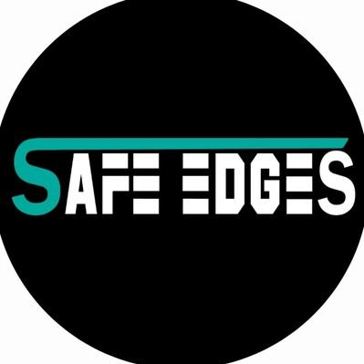

## About:

 naman is a professional smart contract security researcher with focused expertise in auditing **Solidity**, **Rust** based contracts and decentralized infrastructure across leading blockchain ecosystems, including **EVM**, **Solana**, **Cosmos** **(CosmWasm)**.

naman has successfully conducted over **150+** audits in which **25+** was **Rust audits 🦀** and found over **420+ Critical/High** issues along with Medium/Low/Informationls.

He is trusted by:  Cyfrin,  Guardian,  Credshields ,  CODESPECT ,  BurraSec,  Shieldify,  Hashlock, and  Safe Edges.

For private audits or security consulting, please reach out to me on via:

- Twitter: [@namx05](https://x.com/namx05)
- Telegram: [@namx05](https://t.me/namx05)

---

# Summary

|   Crit/High    | Medium risk | [Public Audits](#public-audits) | [Private Audits](#private-audits) |
| :------------: | :---------: | :-----------------------------: | :-------------------------------: |
| 420+ Crit/High | 280+ Medium |                8                |                142                |

## Private Audits

| Protocol                           | Description                             | Ecosystem         | Report / Findings                                                                                         | Provider                                                                               |
| ---------------------------------- | --------------------------------------- | ----------------- | --------------------------------------------------------------------------------------------------------- | -------------------------------------------------------------------------------------- |
|                                 |
| <b>2025</b>                        |
| Private                            | TradeFi                                 | 🦀 Solana         | 🔒                                                                                                        |  Cyfrin                  |
| Private                            | AMM, Staking                            | ♦ EVM             | 🔒                                                                                                        |  Hashlock              |
| Private                            | GameFi                                  | 🦀 Solana         | 🔒                                                                                                        |  Cyfrin                  |
| N4T                                | Launchpad                               | ♦ EVM             | 🔒                                                                                                        |  Hashlock              |
| Emergence Art                      | NFT Sale                                | ♦ EVM             | [📄](audit-reports/pdf/Emergence.art-Smart-Contract-Audit-Report-Final-Repot-v2.pdf) ( 2 High, 2 Medium ) |  Hashlock              |
| Centrifuge                         | Cross Chain, AMM                        | ♦ EVM             | 🔒                                                                                                        |  BurraSec              |
| Vrine                              | Presale, Launchpad                      | ♦ EVM             | [📄](audit-reports/pdf/Vrine-Smart-Contract-Audit-Report-Final-Report-v2.pdf) ( 1 High, 2 Medium )        |  Hashlock              |
| Mandala                            | Launchpad                               | ♦ EVM             | [📄](audit-reports/pdf/Mandala_Presale_2_Final_Report.pdf) ( 1 High )                                     |  Credshields        |
| Wager Program                      | GameFi                                  | 🦀 Solana         | [📄](audit-reports/pdf/WAGER_PROGRAM_SMART_CONTRACT_AUDIT.pdf) ( 2 High )                                 |  Solo                    |
| Better Bank                        | Lending & Borrowing                     | ♦ EVM             | [📄](audit-reports/pdf/032_CODESPECT_BETTERBANK.pdf) ( 6 Medium )                                         |  CODESPECT            |
| Etherspot: GTP Module              | Account Abstraction, Paymaster          | ♦ EVM             | [📄](audit-reports/pdf/Etherspot-GTP-Module-Security-Review.pdf) (1 Crit, 3 High, 6 Medium )              |  Shieldify         |
| Safle                              | Cross Chain Registrar                   | ♦ EVM             | [📄](audit-reports/pdf/Safle_Final_Audit_Report.pdf) ( 2 Crit, 1 High, 3 Medium )                         |  Credshields        |
| FUN Token Giveaway                 |                                         | ♦ EVM             | [📄](audit-reports/pdf/Fun_Token_Final_Audit_Report.pdf) ( 11 Crit, 7 High, 4 Medium )                    |  Credshields        |
| Beetle Games                       | NFT Staking, GameFi                     | ♦ EVM             | [📄](audit-reports/pdf/Beetle-Security-Review.pdf) ( 1 Crit, 1 Medium )                                   |  Shieldify         |
| Amgi Studios Round 2               | Cross Chain, Staking                    | ♦ EVM             | 🔒 ( 7 Crit, 2 High, 2 Medium )                                                                           |  Credshields        |
| Private                            | TradFi                                  | 🦀 Solana         | 🔒 ( - )                                                                                                  |  Cyfrin                  |
| Vouch                              | Tokenomics                              | ♦ EVM             | [📄](audit-reports/pdf/Vouch_Token_and_Distribution_Final_Audit_Report.pdf) ( 2 Crit, 5 Medium )          |  Credshields        |
| Zodor                              | Staking                                 | ♦ EVM             | [📄](audit-reports/pdf/Zodor_Staking_Final_Audit_Report.pdf) ( 2 Crit, 1 Medium )                         |  Credshields        |
| Taco Studios: Okidori              | NFT Tokonomics, Marketplace, Royalty    | ♦ EVM             | [📄](audit-reports/pdf/Okidori_Final_Audit_Report.pdf) ( 2 Crit, 1 High, 1 Medium )                       |  Credshields        |
| Tarmiiz                            | Staking Vault                           | ♦ EVM             | [📄](audit-reports/pdf/Tarmiiz_Final_Audit_Report.pdf) ( 2 Crit, 3 High, 5 Medium )                       |  Credshields        |
| Amgi Studios                       | Cross Chain NFT Staking                 | ♦ EVM             | 🔒 ( 16 Crit, 7 High, 7 Medium )                                                                          |  Credshields        |
| GlueX Protocol                     | DeFi, Router                            | ♦ EVM             | [📄](audit-reports/pdf/GlueX-V2-Security-Review.pdf) ( 3 High, 2 Medium )                                 |  Shieldify         |
| DotLabs: Mushi                     | DeFi, Lending/Borrowing                 | 🦀 Solana         | [📄](audit-reports/pdf/Mushi_V2_0_Final_Audit_Report.pdf) ( 1 Crit, 3 High, 4 Medium )                    |  Credshields        |
| Manadotwin                         | Vesting, Bonding Curve                  | ♦ EVM             | [📄](audit-reports/pdf/Manadotwin_Audit_Final_Report.pdf) ( 2 Crit, 1 High, 2 Medium )                    |  Credshields        |
| Amgi Studios                       | NFT Staking, Tokenomics                 | ♦ EVM             | 🔒 ( 4 Crit, 3 High, 2 Medium)                                                                            |  Credshields        |
| Real Proton                        | Tokenomics                              | ♦ EVM             | 🔒 ( 4 Crit, 3 High, 4 Medium)                                                                            |  Credshields        |
| Clique Lock                        | Vesting, SPL                            | 🦀 Solana         | 🔒 ( 4 Medium )                                                                                           |  Safe Edges           |
| Terplayer Hodl                     | DeFi, Lending/Borrowing                 | 🻠Berachain      | [📄](audit-reports/pdf/Terplayer-Hodl-Security-Review.pdf) ( 1 Medium )                                   |  Shieldify         |
| Ginza Gaming                       | Cross Chain, GameFi                     | 🦀 Solana / ♦ EVM | 🔒 ( 3 Crit, 2 High, 5 Medium )                                                                           |  Guardian Audits |
| Power Couple Coin: Staking Panelty | Staking                                 | 🦀 Solana         | 🔒 ( 4 Crit, 1 Medium )                                                                                   |  Credshields        |
| Power Couple Coin: Staking         | Staking                                 | 🦀 Solana         | 🔒 ( 4 Crit, 2 Medium )                                                                                   |  Credshields        |
| Power Couple Coin: Selltax         | DeFi                                    | 🦀 Solana         | 🔒 ( 6 Crit, 2 Medium )                                                                                   |  Credshields        |
| Power Couple Coin: Lottery         | Staking, Lottery                        | 🦀 Solana         | [📄](audit-reports/pdf/Lottery_Contracts_Final_Audit_Report.pdf) ( 6 Crit, 1 High, 3 Medium )             |  Credshields        |
| Artulabs Limited                   | Airdrop, SPL Tokens                     | 🦀 Solana         | [📄](audit-reports/pdf/Artu_Rust_Final_Audit_Report.pdf) ( 1 Crit, 3 High, 3 Medium )                     |  Credshields        |
| Artulabs Limited                   | Vesting, ERC20                          | ♦ EVM             | [📄](audit-reports/pdf/Artu_Solidity_Final_Audit_Report.pdf) ( 1 High, 2 Medium )                         |  Credshields        |
| LERN360                            | ERC20                                   | ♦ EVM             | [📄](audit-reports/pdf/LERNToken_Final_Audit_Report.pdf) ( 2 High )                                       |  Credshields        |
| Fomodotbiz                         | AMM, Bonding Curve                      | ♦ EVM             | [📄](audit-reports/pdf/Fomodotbiz_Final_Audit_Report.pdf) ( 3 Crit, 3 Medium )                            |  Credshields        |
| mew.gg                             | AMM                                     | ♦ EVM             | [📄](audit-reports/pdf/mew.gg_Contracts_Final_Audit_Report.pdf) ( 1 High )                                |  Credshields        |
| Hemi Labs                          | Vault                                   | ♦ EVM             | [📄](audit-reports/pdf/Hemi_Labs_Final_Audit_Report.pdf) ( 1 High, 3 Medium)                              |  Credshields        |
| FLAT Protocol                      | Defi, Staking, Vesting                  | ♦ EVM             | 🔒 ( 1 Crit, 1 High, 1 Medium )                                                                           |  Solo                    |
| W3.Labs                            | Staking Vault                           | ♦ EVM             | [📄](audit-reports/pdf/W3.labs_Final_Audit_Report.pdf) ( 4 Medium )                                       |  Credshields        |
| After Finance                      | Lending/Borrowing, Yeild                | ♦ EVM             | [📄](audit-reports/pdf/After-Finance-Report.pdf) ( 1 Medium )                                             | Arsen Blockchain Security                                                              |
| BRLA Digital                       | AMM                                     | ♦ EVM             | [📄](audit-reports/pdf/BRLA_Final_Audit_Report.pdf) ( 2 Crit, 4 Medium )                                  |  Credshields        |
| Metaco Intelligence Corporation    | Restaking                               | ♦ EVM             | [📄](audit-reports/pdf/Zoth_Final_Audit_Report.pdf) ( 1 Crit, 2 High, 3 Medium )                          |  Credshields        |
| Landslide                          | ICM (interchain Messaging), Cross Chain | ♦ EVM             | [📄](audit-reports/pdf/Landslide_Final_Audit_Report.pdf) ( 4 Crit, 3 High, 1 Medium )                     |  Credshields        |
|                                 |
| <b>2024</b>                        |
| Superbots                          | Trading Vault                           | ♦ EVM             | 🔒 ( 3 Crit, 2 High, 5 Medium )                                                                           |  Credshields        |
| AllinGames: Bacarrat               | GameFi                                  | 🦀 CosmWasm       | [📄](audit-reports/pdf/AllInGames_Baccarat_Final_Audit_Report.pdf) ( 1 Medium )                           |  Credshields        |
| AllinGames: Bank                   | GameFi                                  | 🦀 CosmWasm       | [📄](audit-reports/pdf/AllInGames_Bank_Final_Audit_Report.pdf) ( 4 Crit, 5 Medium )                       |  Credshields        |
| AllinGames: Classic                | GameFi                                  | 🦀 CosmWasm       | [📄](audit-reports/pdf/AllInGames_Classic_Dice_Final_Audit_Report.pdf) ( 1 Crit, 1 Medium )               |  Credshields        |
| AllinGames: Coin Flip              | GameFi                                  | 🦀 CosmWasm       | [📄](audit-reports/pdf/AllInGames_Coin_Flip_Final_Audit_Report.pdf) ( 1 Crit, 1 High )                    |  Credshields        |
| AllinGames: Hash Dice              | GameFi                                  | 🦀 CosmWasm       | [📄](audit-reports/pdf/AllInGames_Hash_Dice_Final_Audit_Report.pdf) ( 1 Crit, 1 High )                    |  Credshields        |
| AllinGames: Limbo                  | GameFi                                  | 🦀 CosmWasm       | [📄](audit-reports/pdf/AllInGames_Limbo_Final_Audit_Report.pdf) ( 2 Medium )                              |  Credshields        |
| AllinGames: Lottery                | GameFi                                  | 🦀 CosmWasm       | [📄](audit-reports/pdf/AllInGames_Lottery_Final_Audit_Report.pdf) ( 2 Crit, 1 Medium )                    |  Credshields        |
| Arcana: Browser Extenstion         | Wallet                                  | Bowser Extenstion | [📄](audit-reports/pdf/Arcana_Wallet_Final_Audit_Report.pdf) ( 1 Medium )                                 |  Credshields        |
| AllinGames: Exchange V2            | GameFi                                  | 🦀 CosmWasm       | 🔒 ( 5 Crit,4 Medium )                                                                                    |  Credshields        |
| Arcana: Vault                      | ERC4626, Vault                          | ♦ EVM             | 🔒 ( 1 High, 3 Medium )                                                                                   |  Credshields        |
| Dojima                             | DLT, Omni Chain                         | Go                | 🔒 ( 1 Crit, 1 High, 6 Medium )                                                                           |  Credshields        |
| Save Planet Earth                  | DeFi                                    | ♦ EVM             | [📄](audit-reports/pdf/SPE_Smart_Contract_Final_Audit_Report.pdf) ( 2 Crit, 1 High,2 Medium )             |  Credshields        |
| Lara Protocol                      | Staking, Vesting                        | ♦ EVM             | [📄](audit-reports/pdf/Lara_Liquid_Staking_Final_Audit_Report.pdf) ( 5 Medium )                           |  Credshields        |
| Dojima                             | Omni Chain                              | 🦀 Solana         | 🔒 ( 3 High, 4 Medium )                                                                                   |  Credshields        |
| Lendtroller                        | Cross Chain                             | ♦ EVM             | 🔒 ( 2 Crit, 1 High, 3 Medium )                                                                           |  Credshields        |
| Balance                            | Airdrop, Tokenomics                     | ♦ EVM             | 🔒 ( 1 Crit, 2 High, 4 Medium )                                                                           |  Credshields        |
| Dojima                             | Omni Chain, Cross Chain                 | ♦ EVM             | 🔒 ( 5 Crit, 7 High, 3 Medium )                                                                           |  Credshields        |
| Protop Vesting                     |                                         | ♦ EVM             | [📄](audit-reports/pdf/Protop_Vesting_Contracts_Final_Report.pdf) ( 1 Crit )                              |  Credshields        |
| Vouch                              |                                         | ♦ EVM             | [📄](audit-reports/pdf/Vouch_Contract_Final_Audit_Report.pdf) ( 1 High, 1 Medium )                        |  Credshields        |
| SAN                                |                                         | ♦ EVM             | [📄](audit-reports/pdf/SAN_Final_Report.pdf) ( 1 High, 4 Medium )                                         |  Credshields        |
| Registrar                          | ENS                                     | ♦ EVM             | 🔒 ( 2 Medium )                                                                                           |  Credshields        |
| Tribally Games                     |                                         | ♦ EVM             | [📄](audit-reports/pdf/Tribally_Games_Final_Report.pdf) ( 1 High )                                        |  Credshields        |
| Plutope                            | DeFi                                    | ♦ EVM             | [📄](audit-reports/pdf/Plutope_Final_Audit_Report.pdf) ( 2 Crit, 5 Medium )                               |  Credshields        |
| LogX                               | Validator                               | ♦ EVM             | [📄](audit-reports/pdf/LogX_Token_Final_Report.pdf) ( 3 Crit, 2 High, 2 Medium )                          |  Credshields        |
| Kresus                             | Account Abstraction                     | ♦ EVM             | [📄](audit-reports/pdf/Kresus_Final_Audit_Report.pdf) ( 1 Crit, 1 High, 1 Medium )                        |  Credshields        |
| Rex Protocol                       | DeFi, Staking                           | ♦ EVM             | [📄](audit-reports/pdf/Rex_Exchange_Final_Audit_Report.pdf) ( 1 Crit, 5 High, 4 Medium )                  |  Credshields        |
| aUSD: Stable Jack                  | AMM                                     | ♦ EVM             | [📄](audit-reports/pdf/aUSD_SC_Final_Audit_Report.pdf) ( 3 Crit, 2 High, 11 Medium )                      |  Credshields        |
| Arcana Staking                     | Staking                                 | ♦ EVM             | [📄](audit-reports/pdf/Arcana_Staking_Contract_Final_Audit_Report.pdf) ( 1 High )                         |  Credshields        |
| Wasset                             | Staking, Vesting                        | ♦ EVM             | [📄](audit-reports/pdf/Wasset_Final_Audit_Report.pdf) ( 2 Crit, 3 Medium )                                |  Credshields        |
| Numa                               | DeFi, Lending/Borrowing                 | ♦ EVM             | [📄](audit-reports/pdf/Numa_Final_Audit_Report.pdf) ( 1 Medium )                                          |  Credshields        |
| Hyacinth                           | Bank, DeFi                              | ♦ EVM             | [📄](audit-reports/md/Hyacinth-security-review.md) ( 2 Crit, 2 Medium )                                   |  Solo                    |

## Public Audits:

| Rank | Contest                                                                                      | Description           | Lang-Ecosystem | Report / Findings                                                                                                                 |
| ---- | -------------------------------------------------------------------------------------------- | --------------------- | -------------- | --------------------------------------------------------------------------------------------------------------------------------- |
|      |                                                                                              |                       |                |                                                                                                                                   |
|      |  Super DCA Liquidity Network | AMM, Uniswap V4 Hooks | ♦ EVM          | 📄 - (ongoing) ( 1 High, 1 Medium )                                                                                               |
| 7    |  Metropolis                   | Lending/Borrwoing     | ♦ EVM          | [📄](https://cantina.xyz/competitions/076935b1-2706-48c6-bf0a-b3656aa24194/leaderboard) ( 1 Medium )                              |
| 44   |  Eggstravaganza             | GameFi, NFT           | ♦ EVM          | [📄](https://codehawks.cyfrin.io/c/2025-04-eggstravaganza/results?lt=contest&page=5&sc=xp&sj=reward&t=leaderboard) ( 2 High )     |
| 62   |  Rust Fund                  | Crowdfunding          | 🦀 Solana      | [📄](https://codehawks.cyfrin.io/c/2025-03-rustfund/results?lt=contest&page=1&sc=xp&sj=reward&t=leaderboard) ( 1 High, 2 Medium ) |
| 16   |  Hyperland                    | Lending/Borrowing     | ♦ EVM          | [📄](https://cantina.xyz/competitions/cd180bb3-5d7d-46ed-8b99-d905e54a9d0b/leaderboard) ( 1 High )                                |
| 177  |  Tadle                      | Bridge                | ♦ EVM          | [📄](https://codehawks.cyfrin.io/c/2024-08-tadle/results?lt=contest&page=1&sc=reward&sj=reward&t=leaderboard) ( 1 Medium )        |
| 39   |  Trait Forge                       | GameFi                | ♦ EVM          | [📄](https://code4rena.com/audits/2024-07-traitforge) ( 1 High )                                                                  |
| 89   |  Pool Together                     | Staking, Yeild        | ♦ EVM          | [📄](https://code4rena.com/audits/2023-07-pooltogether) ( 1 Medium )                                                              |
